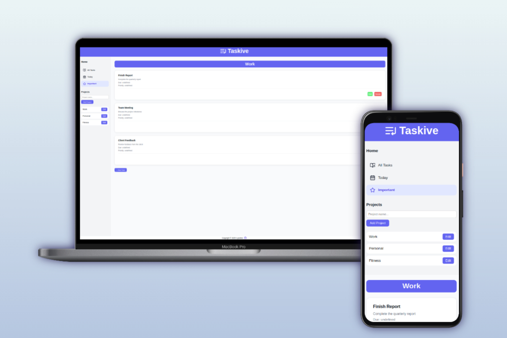

# Project: Taskive - To-Do List Application

Taskive is a dynamic and responsive to-do list application designed to help users organize their tasks efficiently. Built with a clean user interface, Taskive enables users to manage tasks, organize them into projects, and prioritize them, all while focusing on modular JavaScript and DOM-based content rendering. The project is powered by Webpack for bundling and npm for managing dependencies and scripts. Future updates may include local storage integration for persistent task management.

---

## Features & Implementation

+ **Dynamic Task Management** – Add, edit, and delete tasks dynamically without page reloads.
+ **Project Organization** – Group tasks into projects for better categorization.
+ **Priority Levels** – Assign priority levels (Low, Medium, High) to tasks.
+ **Responsive Design** – A mobile-first layout ensures smooth usability across all screen sizes.
+ **Customizable Navigation** – Highlight the active navigation item dynamically on selection.
+ **Lucide Icons Integration** – Enhanced UI with modern SVG-based icons.
+ **Webpack Integration** – Bundled assets for optimized performance and code splitting.
+ **npm for Dependency Management** – Simplifies handling project dependencies and scripts.
+ **Future Local Storage Support** – Planned implementation of local storage for task persistence.

---

## Learning Outcomes

+ Strengthened my understanding of DOM manipulation and handling events in JavaScript.
+ Learned a lot from debugging and tweaking the UI to make it work smoothly.
+ Enhanced my ability to work with modern JavaScript libraries, such as Lucide, for SVG icons.
+ Learned to manage CSS layouts, including Flexbox and transitions, for polished designs.
+ Set up Webpack to bundle everything together — finally starting to get how it all fits.
+ Used npm scripts to speed things up during development and make building for production easier.

---

### Challenges Faced

+ **DOM Manipulation** – Managing the addition, removal, and dynamic updates of tasks and projects was a significant challenge. I solved this by implementing event delegation and modularizing task-related code.
+ **Dynamic Navigation** – Highlighting the active navigation item required JavaScript logic to toggle classes efficiently.
+ **Icon Customization** – Adjusting Lucide icons' size and placement involved understanding SVG styling and CSS techniques.
+ **Webpack Configuration** – Setting up Webpack to handle ES6 modules, CSS, and assets, while ensuring an optimized build, was a learning curve.

---

## Live Demo

https://n-pontes.github.io/todo-list-app/

---

## Screenshots



---

## Built With

### Technologies

+ **HTML5** – Structure and semantic layout.
+ **CSS3** – Responsive design and transitions.
+ **JavaScript (ES6)** – Dynamic functionality and modular architecture.
+ **Lucide Icons** – SVG-based icons for a modern UI.
+ **Webpack** – Module bundler for optimized asset management.
+ **ESLint** – Code linting to enforce consistent style and catch errors early.

### Tools

+ Visual Studio Code
+ Linux Terminal
+ Git & GitHub
+ npm

---

## Installation

1. Clone the repository:
   ```sh
   git clone https://github.com/n-pontes/todo-list-app.git
   ```

2. Navigate to the project directory:
   ```sh
   cd todo-list-app
   ```

3. Install dependencies:
   ```sh
   npm install
   ```

4. Start the development server:
   ```sh
   npm start
   ```

5. Build the production version:
   ```sh
   npm run build
   ```

6. Open the `dist/index.html` file in your browser:
   ```sh
   open dist/index.html
   ```
   (Alternatively, you can deploy the `dist` folder to a web server.)

---

## Future Updates

+ **Local Storage Integration** – Persist user tasks and projects across sessions.
+ **Improved UI/UX** – Add animations and better feedback mechanisms.
+ **Sorting and Filters** – Enable sorting tasks by priority or due date, and filtering by project.

---

## License

This project is MIT licensed. Feel free to use and modify it for your own purposes!